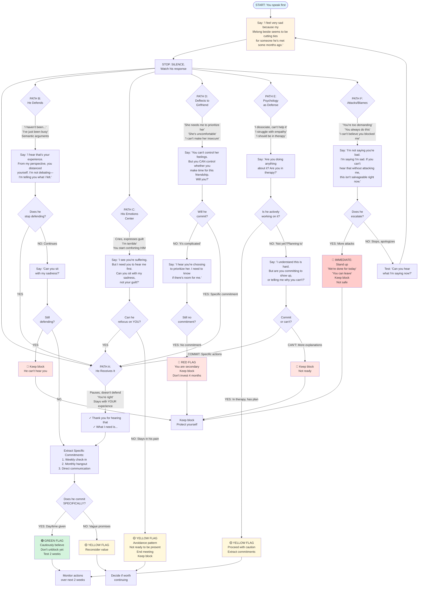

# Meeting Decision Tree Flowchart

## Visual Navigation Guide for Tomorrow's Conversation

---

## Text-Based Decision Tree

```
START: Opening Statement
│
├─→ "I feel very sad because my lifelong bestie seems to be
│   cutting ties for someone he's met some months ago."
│
└─→ [PAUSE. SILENCE. OBSERVE HIS RESPONSE]
     │
     ├─→ PATH A: HE RECEIVES IT (Rare) 🟢
     │   ├─ Pauses, doesn't defend immediately
     │   ├─ "You're right. I have been pulling away."
     │   ├─ Stays with YOUR experience
     │   └─→ YOUR MOVE:
     │       ├─ "Thank you for hearing that"
     │       └─ "What I need is [specifics]"
     │       └─→ EXTRACT COMMITMENTS
     │           ├─ Weekly check-in (which day?)
     │           ├─ Monthly hangout (how often?)
     │           ├─ Direct communication (no ghosting)
     │           └─→ DOES HE COMMIT SPECIFICALLY?
     │               ├─ YES (day/time) → CAUTIOUSLY BELIEVE
     │               │                  ├─ Don't unblock yet
     │               │                  └─ Test over 2 weeks
     │               └─ NO (vague) → YELLOW FLAG
     │                              └─ Reconsider meeting value
     │
     ├─→ PATH B: HE DEFENDS (Most Likely) 🟡
     │   ├─ "I haven't been cutting ties"
     │   ├─ "I've just been busy/overwhelmed"
     │   ├─ Semantic arguments
     │   └─→ YOUR MOVE:
     │       ├─ "I hear that's your experience. From my
     │       │   perspective, you distanced yourself."
     │       └─ "I'm not debating. I'm telling you what I felt."
     │       └─→ DOES HE SHIFT?
     │           ├─ YES: Stops defending → GO TO PATH A
     │           └─ NO: Continues defending
     │               └─→ YOUR MOVE:
     │                   ├─ "Can you sit with my sadness?"
     │                   └─→ STILL DEFENDING?
     │                       ├─ YES → Keep block, he can't hear you
     │                       └─ NO → Extract commitments (PATH A)
     │
     ├─→ PATH C: HIS EMOTIONS CENTER 🟡
     │   ├─ He cries, expresses guilt
     │   ├─ "I'm such a terrible friend"
     │   ├─ You start comforting HIM
     │   └─→ YOUR MOVE:
     │       ├─ "I see you're suffering. But I need you
     │       │   to hear me first."
     │       └─ "Can you sit with my sadness, not your guilt?"
     │       └─→ CAN HE REDIRECT TO YOU?
     │           ├─ YES: Refocuses on your experience → PATH A
     │           └─ NO: Stays in his pain
     │               └─→ ASSESSMENT:
     │                   ├─ This is avoidance pattern
     │                   ├─ He's not ready to be present
     │                   └─→ DECISION:
     │                       ├─ End meeting: "Let's stop here"
     │                       └─ Keep block until he can be present
     │
     ├─→ PATH D: HE DEFLECTS TO GIRLFRIEND 🔴
     │   ├─ "She needs me to prioritize her"
     │   ├─ "She's uncomfortable with our friendship"
     │   ├─ "I can't make her insecure"
     │   └─→ YOUR MOVE:
     │       ├─ "You can't control her feelings. But you CAN
     │       │   control whether you make time for this friendship."
     │       └─ "Will you?"
     │       └─→ WILL HE COMMIT?
     │           ├─ NO: "It's complicated because of her"
     │           │   └─→ YOUR MOVE:
     │           │       ├─ "I hear you're choosing to prioritize her"
     │           │       └─ "I need to know if there's room for me"
     │           │       └─→ STILL NO COMMITMENT?
     │           │           └─→ ACCEPT REALITY:
     │           │               ├─ You are secondary
     │           │               ├─ Keep block
     │           │               └─ Don't invest 4 months false-hoping
     │           └─ YES: Makes specific commitment → PATH A
     │
     ├─→ PATH E: PSYCHOLOGY AS DEFENSE 🟡
     │   ├─ "I dissociate, I can't help it"
     │   ├─ "I struggle with empathy"
     │   ├─ "I know I should be in therapy"
     │   └─→ YOUR MOVE:
     │       ├─ "Are you doing anything about it?"
     │       └─ "Are you in therapy?"
     │       └─→ IS HE ACTIVELY WORKING ON IT?
     │           ├─ YES: In therapy, has plan → PATH A
     │           │                             (with caution)
     │           └─ NO: "Not yet" / "Planning to"
     │               └─→ YOUR MOVE:
     │                   ├─ "I understand this is hard. But right now,
     │                   │   are you committing to show up, or telling
     │                   │   me why you can't?"
     │                   └─→ HIS ANSWER?
     │                       ├─ COMMIT: Specific actions → PATH A
     │                       └─ CAN'T: More explanations → Keep block
     │
     └─→ PATH F: HE ATTACKS/BLAMES 🔴
         ├─ "You're too demanding/sensitive"
         ├─ "You always do this"
         ├─ "I can't believe you blocked me"
         ├─ Turns your sadness into judgment
         └─→ YOUR MOVE:
             ├─ "I'm not saying you're bad. I'm saying I'm sad."
             └─ "If you can't hear that without attacking me,
                 this isn't salvageable right now."
             └─→ DOES HE ESCALATE?
                 ├─ YES: More attacks
                 │   └─→ IMMEDIATE ACTION:
                 │       ├─ Stand up
                 │       ├─ "I think we're done for today"
                 │       ├─ "You can leave"
                 │       └─→ DECISION:
                 │           ├─ Keep block
                 │           ├─ Not safe to be vulnerable with
                 │           └─ Not salvageable in one conversation
                 └─ NO: Stops, apologizes
                     └─→ Test if sincere:
                         ├─ "Can you hear what I'm saying now?"
                         └─→ Restart from opening statement
```

---

## Mermaid Flowchart (Visual Rendering)



---

## Color-Coded Assessment Legend

### 🟢 GREEN FLAGS (Rare but hopeful)
- Takes responsibility
- Acknowledges distancing
- Specific commitments (days/times)
- Shows understanding of YOUR pain
- **Action:** Cautiously believe, test over 2 weeks

### 🟡 YELLOW FLAGS (Most likely)
- Defends but eventually shifts
- Uses psychology without action plan
- Centers his emotions
- Vague promises ("I'll try")
- **Action:** Extract specifics, monitor closely

### 🔴 RED FLAGS (Deal-breakers)
- Can't take accountability
- Attacks or blames you
- Won't commit to specifics
- Prioritizes girlfriend over 18-year friendship
- **Action:** Keep block, protect yourself

---

## Navigation Tips

1. **Start at the top** with your opening statement
2. **Observe which PATH he takes** (could be multiple)
3. **Follow your scripted response** for that path
4. **Track his reaction** to your response
5. **Note the flag color** for that path
6. **Make decision** about unblocking based on overall pattern

### Multiple Paths Possible
He may cycle through several paths in one conversation:
- Start with **Path B** (Defending)
- Move to **Path C** (His emotions)
- End at **Path D** (Girlfriend deflection)

**Your job:** Navigate each path, note the overall pattern

---

## Emergency Exit Map

```
ANY PATH → Feeling unsafe/overwhelmed
    ↓
"I need a minute" → Bathroom break → Ground (5-4-3-2-1)
    ↓
Can you continue?
    ├─ YES → Return, resume
    └─ NO → "I think we should stop here"
              "You can leave"
```

---

## Post-Meeting Decision Matrix

| His Behavior | Flags | Action |
|--------------|-------|--------|
| Took responsibility, specific commitments | 🟢 | Don't unblock yet. Test 2 weeks. |
| Defended but eventually heard you, vague commitments | 🟡 | Extract specifics. Wait 1 week. Watch for follow-through. |
| Centered his emotions, couldn't refocus on you | 🟡 | Keep block. He's not ready to be present. |
| Deflected to girlfriend, no room for you | 🔴 | Keep block. Accept you're secondary. |
| Used psychology without action plan | 🟡 | Keep block unless he starts therapy immediately. |
| Attacked/blamed you | 🔴 | Keep block indefinitely. Not safe. |

---

## The North Star Question

When you're lost in the conversation, return to this:

> **"Can you sit with my sadness without defending, explaining, or making it about you?"**

If YES → There's something to work with

If NO → There's nothing to build on right now

---

*This is your map. You don't have to be perfect. Just navigate one step at a time.*

*Trust what you observe. Not what you hope.*
