# Meeting Decision Tree Flowchart

## Visual Navigation Guide for Tomorrow's Conversation

---

## Text-Based Decision Tree

```
START: Opening Statement
│
├─→ "I feel very sad because my lifelong bestie seems to be
│   cutting ties for someone he's met some months ago."
│
└─→ [PAUSE. SILENCE. OBSERVE HIS RESPONSE]
     │
     ├─→ PATH A: HE RECEIVES IT (Rare) 🟢
     │   ├─ Pauses, doesn't defend immediately
     │   ├─ "You're right. I have been pulling away."
     │   ├─ Stays with YOUR experience
     │   └─→ YOUR MOVE:
     │       ├─ "Thank you for hearing that"
     │       └─ "What I need is [specifics]"
     │       └─→ EXTRACT COMMITMENTS
     │           ├─ Weekly check-in (which day?)
     │           ├─ Monthly hangout (how often?)
     │           ├─ Direct communication (no ghosting)
     │           └─→ DOES HE COMMIT SPECIFICALLY?
     │               ├─ YES (day/time) → CAUTIOUSLY BELIEVE
     │               │                  ├─ Don't unblock yet
     │               │                  └─ Test over 2 weeks
     │               └─ NO (vague) → YELLOW FLAG
     │                              └─ Reconsider meeting value
     │
     ├─→ PATH B: HE DEFENDS (Most Likely) 🟡
     │   ├─ "I haven't been cutting ties"
     │   ├─ "I've just been busy/overwhelmed"
     │   ├─ Semantic arguments
     │   └─→ YOUR MOVE:
     │       ├─ "I hear that's your experience. From my
     │       │   perspective, you distanced yourself."
     │       └─ "I'm not debating. I'm telling you what I felt."
     │       └─→ DOES HE SHIFT?
     │           ├─ YES: Stops defending → GO TO PATH A
     │           └─ NO: Continues defending
     │               └─→ YOUR MOVE:
     │                   ├─ "Can you sit with my sadness?"
     │                   └─→ STILL DEFENDING?
     │                       ├─ YES → Keep block, he can't hear you
     │                       └─ NO → Extract commitments (PATH A)
     │
     ├─→ PATH C: HIS EMOTIONS CENTER 🟡
     │   ├─ He cries, expresses guilt
     │   ├─ "I'm such a terrible friend"
     │   ├─ You start comforting HIM
     │   └─→ YOUR MOVE:
     │       ├─ "I see you're suffering. But I need you
     │       │   to hear me first."
     │       └─ "Can you sit with my sadness, not your guilt?"
     │       └─→ CAN HE REDIRECT TO YOU?
     │           ├─ YES: Refocuses on your experience → PATH A
     │           └─ NO: Stays in his pain
     │               └─→ ASSESSMENT:
     │                   ├─ This is avoidance pattern
     │                   ├─ He's not ready to be present
     │                   └─→ DECISION:
     │                       ├─ End meeting: "Let's stop here"
     │                       └─ Keep block until he can be present
     │
     ├─→ PATH D: HE DEFLECTS TO GIRLFRIEND 🔴
     │   ├─ "She needs me to prioritize her"
     │   ├─ "She's uncomfortable with our friendship"
     │   ├─ "I can't make her insecure"
     │   └─→ YOUR MOVE:
     │       ├─ "You can't control her feelings. But you CAN
     │       │   control whether you make time for this friendship."
     │       └─ "Will you?"
     │       └─→ WILL HE COMMIT?
     │           ├─ NO: "It's complicated because of her"
     │           │   └─→ YOUR MOVE:
     │           │       ├─ "I hear you're choosing to prioritize her"
     │           │       └─ "I need to know if there's room for me"
     │           │       └─→ STILL NO COMMITMENT?
     │           │           └─→ ACCEPT REALITY:
     │           │               ├─ You are secondary
     │           │               ├─ Keep block
     │           │               └─ Don't invest 4 months false-hoping
     │           └─ YES: Makes specific commitment → PATH A
     │
     ├─→ PATH E: PSYCHOLOGY AS DEFENSE 🟡
     │   ├─ "I dissociate, I can't help it"
     │   ├─ "I struggle with empathy"
     │   ├─ "I know I should be in therapy"
     │   └─→ YOUR MOVE:
     │       ├─ "Are you doing anything about it?"
     │       └─ "Are you in therapy?"
     │       └─→ IS HE ACTIVELY WORKING ON IT?
     │           ├─ YES: In therapy, has plan → PATH A
     │           │                             (with caution)
     │           └─ NO: "Not yet" / "Planning to"
     │               └─→ YOUR MOVE:
     │                   ├─ "I understand this is hard. But right now,
     │                   │   are you committing to show up, or telling
     │                   │   me why you can't?"
     │                   └─→ HIS ANSWER?
     │                       ├─ COMMIT: Specific actions → PATH A
     │                       └─ CAN'T: More explanations → Keep block
     │
     └─→ PATH F: HE ATTACKS/BLAMES 🔴
         ├─ "You're too demanding/sensitive"
         ├─ "You always do this"
         ├─ "I can't believe you blocked me"
         ├─ Turns your sadness into judgment
         └─→ YOUR MOVE:
             ├─ "I'm not saying you're bad. I'm saying I'm sad."
             └─ "If you can't hear that without attacking me,
                 this isn't salvageable right now."
             └─→ DOES HE ESCALATE?
                 ├─ YES: More attacks
                 │   └─→ IMMEDIATE ACTION:
                 │       ├─ Stand up
                 │       ├─ "I think we're done for today"
                 │       ├─ "You can leave"
                 │       └─→ DECISION:
                 │           ├─ Keep block
                 │           ├─ Not safe to be vulnerable with
                 │           └─ Not salvageable in one conversation
                 └─ NO: Stops, apologizes
                     └─→ Test if sincere:
                         ├─ "Can you hear what I'm saying now?"
                         └─→ Restart from opening statement
```

---

## Mermaid Flowchart (Visual Rendering)

```mermaid
flowchart TD
    Start([START: You speak first]) --> OpeningStatement["Say: 'I feel very sad because my<br/>lifelong bestie seems to be cutting ties<br/>for someone he's met some months ago.'"]
    OpeningStatement --> Silence[STOP. SILENCE.<br/>Watch his response]

    Silence --> PathA{PATH A:<br/>He Receives It}
    Silence --> PathB{PATH B:<br/>He Defends}
    Silence --> PathC{PATH C:<br/>His Emotions<br/>Center}
    Silence --> PathD{PATH D:<br/>Deflects to<br/>Girlfriend}
    Silence --> PathE{PATH E:<br/>Psychology<br/>as Defense}
    Silence --> PathF{PATH F:<br/>Attacks/Blames}

    PathA --> |"Pauses, doesn't defend<br/>'You're right'<br/>Stays with YOUR experience"| ResponseA["✓ Thank you for hearing that<br/>✓ What I need is..."]
    ResponseA --> ExtractCommitments[Extract Specific Commitments:<br/>1. Weekly check-in<br/>2. Monthly hangout<br/>3. Direct communication]
    ExtractCommitments --> CommitCheck{Does he commit<br/>SPECIFICALLY?}
    CommitCheck -->|YES: Day/time given| GreenFlag[🟢 GREEN FLAG<br/>Cautiously believe<br/>Don't unblock yet<br/>Test 2 weeks]
    CommitCheck -->|NO: Vague promises| YellowFlag1[🟡 YELLOW FLAG<br/>Reconsider value]

    PathB -->|"'I haven't been...'<br/>'I've just been busy'<br/>Semantic arguments"| ResponseB["Say: 'I hear that's your experience.<br/>From my perspective, you distanced<br/>yourself. I'm not debating—<br/>I'm telling you what I felt.'"]
    ResponseB --> ShiftCheck{Does he<br/>stop defending?}
    ShiftCheck -->|YES| PathA
    ShiftCheck -->|NO: Continues| ResponseB2["Say: 'Can you sit<br/>with my sadness?'"]
    ResponseB2 --> StillDefending{Still<br/>defending?}
    StillDefending -->|YES| RedFlag1[🔴 Keep block<br/>He can't hear you]
    StillDefending -->|NO| ExtractCommitments

    PathC -->|"Cries, expresses guilt<br/>'I'm terrible'<br/>You start comforting HIM"| ResponseC["Say: 'I see you're suffering.<br/>But I need you to hear me first.<br/>Can you sit with my sadness,<br/>not your guilt?'"]
    ResponseC --> RedirectCheck{Can he<br/>refocus on YOU?}
    RedirectCheck -->|YES| PathA
    RedirectCheck -->|NO: Stays in his pain| YellowFlag2[🟡 YELLOW FLAG<br/>Avoidance pattern<br/>Not ready to be present<br/>End meeting<br/>Keep block]

    PathD -->|"'She needs me to prioritize her'<br/>'She's uncomfortable'<br/>'I can't make her insecure'"| ResponseD["Say: 'You can't control her feelings.<br/>But you CAN control whether you<br/>make time for this friendship.<br/>Will you?'"]
    ResponseD --> CommitCheckD{Will he<br/>commit?}
    CommitCheckD -->|NO: 'It's complicated'| ResponseD2["Say: 'I hear you're choosing<br/>to prioritize her. I need to know<br/>if there's room for me.'"]
    ResponseD2 --> StillNoCommit{Still no<br/>commitment?}
    StillNoCommit -->|YES: No commitment| RedFlag2[🔴 RED FLAG<br/>You are secondary<br/>Keep block<br/>Don't invest 4 months]
    CommitCheckD -->|YES: Specific commitment| PathA

    PathE -->|"'I dissociate, can't help it'<br/>'I struggle with empathy'<br/>'I should be in therapy'"| ResponseE["Say: 'Are you doing anything<br/>about it? Are you in therapy?'"]
    ResponseE --> ActiveWorkCheck{Is he actively<br/>working on it?}
    ActiveWorkCheck -->|YES: In therapy, has plan| YellowFlag3[🟡 YELLOW FLAG<br/>Proceed with caution<br/>Extract commitments]
    ActiveWorkCheck -->|NO: 'Not yet'/'Planning to'| ResponseE2["Say: 'I understand this is hard.<br/>But are you committing to show up,<br/>or telling me why you can't?'"]
    ResponseE2 --> CommitOrCant{Commit<br/>or can't?}
    CommitOrCant -->|COMMIT: Specific actions| PathA
    CommitOrCant -->|CAN'T: More explanations| RedFlag3[🔴 Keep block<br/>Not ready]

    PathF -->|"'You're too demanding'<br/>'You always do this'<br/>'I can't believe you blocked me'"| ResponseF["Say: 'I'm not saying you're bad.<br/>I'm saying I'm sad. If you can't<br/>hear that without attacking me,<br/>this isn't salvageable right now.'"]
    ResponseF --> EscalateCheck{Does he<br/>escalate?}
    EscalateCheck -->|YES: More attacks| EndMeeting[🔴 IMMEDIATE:<br/>Stand up<br/>'We're done for today'<br/>'You can leave'<br/>Keep block<br/>Not safe]
    EscalateCheck -->|NO: Stops, apologizes| TestSincere["Test: 'Can you hear<br/>what I'm saying now?'"]
    TestSincere --> OpeningStatement

    GreenFlag --> Decision1[Monitor actions<br/>over next 2 weeks]
    YellowFlag1 --> Decision2[Decide if worth<br/>continuing]
    YellowFlag2 --> Decision2
    YellowFlag3 --> Decision1
    RedFlag1 --> Decision3[Keep block<br/>Protect yourself]
    RedFlag2 --> Decision3
    RedFlag3 --> Decision3
    EndMeeting --> Decision3

    style Start fill:#e1f5ff
    style OpeningStatement fill:#fff4e1
    style GreenFlag fill:#d4f4dd
    style YellowFlag1 fill:#fff8dc
    style YellowFlag2 fill:#fff8dc
    style YellowFlag3 fill:#fff8dc
    style RedFlag1 fill:#ffe4e1
    style RedFlag2 fill:#ffe4e1
    style RedFlag3 fill:#ffe4e1
    style EndMeeting fill:#ffcccb
```



---

## Color-Coded Assessment Legend

### 🟢 GREEN FLAGS (Rare but hopeful)
- Takes responsibility
- Acknowledges distancing
- Specific commitments (days/times)
- Shows understanding of YOUR pain
- **Action:** Cautiously believe, test over 2 weeks

### 🟡 YELLOW FLAGS (Most likely)
- Defends but eventually shifts
- Uses psychology without action plan
- Centers his emotions
- Vague promises ("I'll try")
- **Action:** Extract specifics, monitor closely

### 🔴 RED FLAGS (Deal-breakers)
- Can't take accountability
- Attacks or blames you
- Won't commit to specifics
- Prioritizes girlfriend over 18-year friendship
- **Action:** Keep block, protect yourself

---

## Navigation Tips

1. **Start at the top** with your opening statement
2. **Observe which PATH he takes** (could be multiple)
3. **Follow your scripted response** for that path
4. **Track his reaction** to your response
5. **Note the flag color** for that path
6. **Make decision** about unblocking based on overall pattern

### Multiple Paths Possible
He may cycle through several paths in one conversation:
- Start with **Path B** (Defending)
- Move to **Path C** (His emotions)
- End at **Path D** (Girlfriend deflection)

**Your job:** Navigate each path, note the overall pattern

---

## Emergency Exit Map

```
ANY PATH → Feeling unsafe/overwhelmed
    ↓
"I need a minute" → Bathroom break → Ground (5-4-3-2-1)
    ↓
Can you continue?
    ├─ YES → Return, resume
    └─ NO → "I think we should stop here"
              "You can leave"
```

---

## Post-Meeting Decision Matrix

| His Behavior | Flags | Action |
|--------------|-------|--------|
| Took responsibility, specific commitments | 🟢 | Don't unblock yet. Test 2 weeks. |
| Defended but eventually heard you, vague commitments | 🟡 | Extract specifics. Wait 1 week. Watch for follow-through. |
| Centered his emotions, couldn't refocus on you | 🟡 | Keep block. He's not ready to be present. |
| Deflected to girlfriend, no room for you | 🔴 | Keep block. Accept you're secondary. |
| Used psychology without action plan | 🟡 | Keep block unless he starts therapy immediately. |
| Attacked/blamed you | 🔴 | Keep block indefinitely. Not safe. |

---

## The North Star Question

When you're lost in the conversation, return to this:

> **"Can you sit with my sadness without defending, explaining, or making it about you?"**

If YES → There's something to work with

If NO → There's nothing to build on right now

---

*This is your map. You don't have to be perfect. Just navigate one step at a time.*

*Trust what you observe. Not what you hope.*
